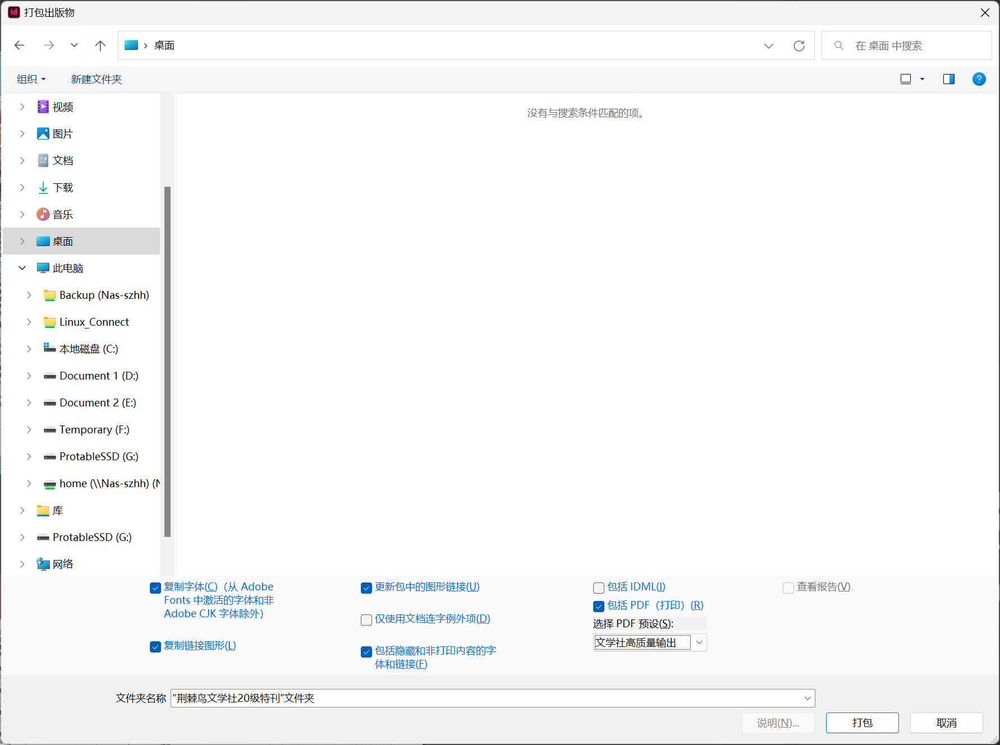

# InDesign 打包
InDesign 自带的**打包**功能可以帮助我们把 InDesign 源文件和使用的素材快捷地汇总到一个文件夹内。
1. 点击**文件->打包**
2. 在弹出的页面中点击**打包**按钮，选择需要保存的位置并调整保存选项
    下附选项注释：
    - 复制字体：保存小部分字体
    - 更新包中的图形链接（必选）：自动更新素材的链接至新的保存位置
    - 复制链接图形（必选）：复制已使用的图形素材
    - 包括ID
1. 点击**打包**即可打包所有的素材和文件