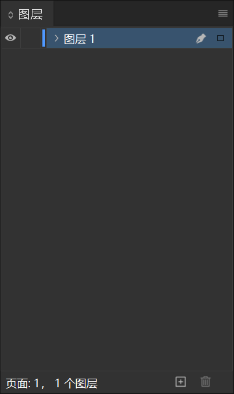
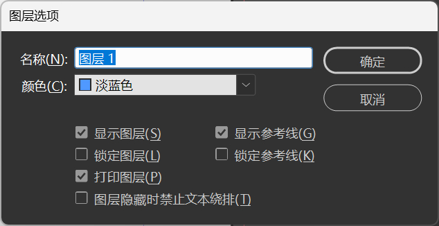
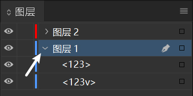

# 3.3 图层和参考线的使用

本节要点：
- 新建图层
- 图层的其他操作
- **参考线**的新建和移除

# 图层
使用专业的图像、视频编辑工具必须要知道使用图层的必要性并熟悉图层相关的操作。  

下面列出图层几个不可替代的作用：
1. 图层可以分离不同的元素，对画面中不同的元素进行分层管理。
2. 图层可以很好地处理元素的遮盖关系。
3. 不同的图层可以通过算法进行混合以达到特殊的效果。

InDesign 的图层面板可以在顶部菜单栏的**窗口->图层**中打开。  

接下来介绍图层面板：  

## 认识图层面板
- 面板中部是各个图层的显示区域。
  - 单击**眼睛图标**可以开启和隐藏图层。
  - 单击眼睛图标右侧的小块**空白**可以锁定图层。
  - 双击图层名可以打开图层选项。
- 面板的底部从右到左分别是图层的**删除**和**新建**按钮。

## 创建和编辑图层
- 点击面板下方的**加号**以添加单个图层
- 选中需要删除的图层再点击面板下方的**垃圾桶**以删除选中的图层
- 双击图层名字可以打开图层选项编辑
  - 名称：图层名称
  - 颜色：更改该图层的颜色标记
  - 其他选项功能如面板中描述

- 按住并拖动图层可以调整图层或元素的上下顺序
- 点击图层左端的小箭头可以展开当前图层

## 图层的其他功能
- 点击图层/元素最右侧的**小方块**可以选择该图层内的所有元素/该元素

## 图层管理
1. 尽量把类似的元素放在同一图层内
2. 图层数量不宜过多，过多的图层反而会给编辑过程带来很多麻烦
3. 图层一定要有清晰的命名

---

# 参考线
参考线是辅助设计师对元素进行进行定位的工具，灵活使用参考线可以让我们的排版统一又好看。

## 参考线的新建和编辑
先介绍参考线的添加方式：
1. 按快捷键**Ctrl+R**打开屏幕标尺。
2. 在标尺上按住鼠标向屏幕中央拖动即可拉出一条参考线。

想要删除一根参考线，只需要按住并拖动想删除的参考线到*参考线所在的页面以外*即可。  
接下来介绍参考线的一些高级操作：
- 选中一条参考线，可以在**属性**面板中对它的位置进行精确修改
- 在页面空白处右键，选择**删除跨页上所有的参考线**即可快速删除当前跨页上的所有参考线

## 善用参考线
1. 查看**属性**面板中参考线的位置可以计算下一根参考线的位置
2. 参考线不宜过多，不再需要的参考线要及时删除